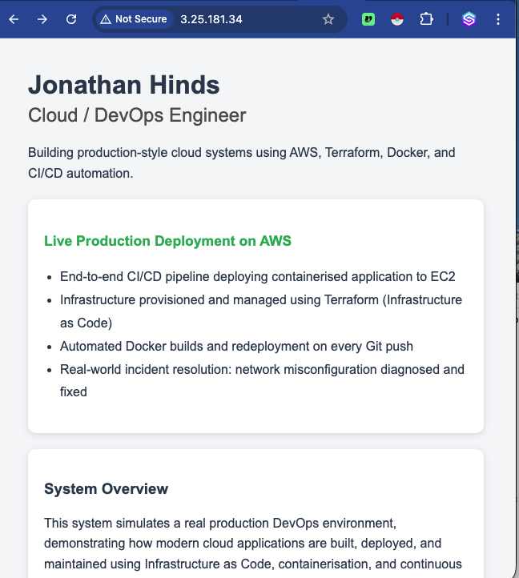
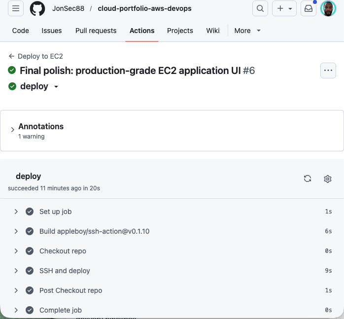
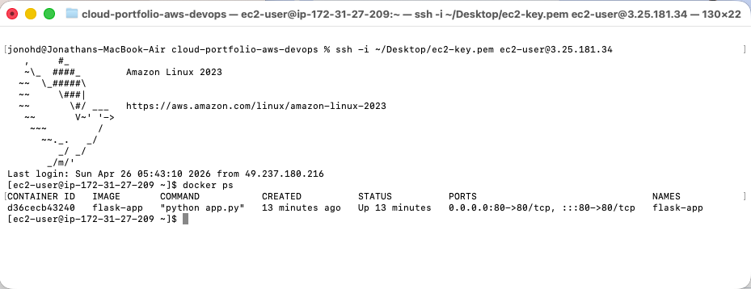
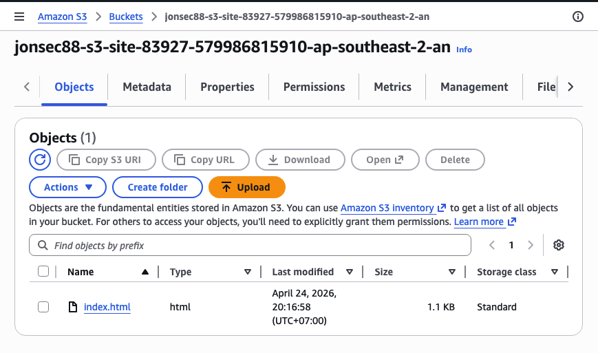
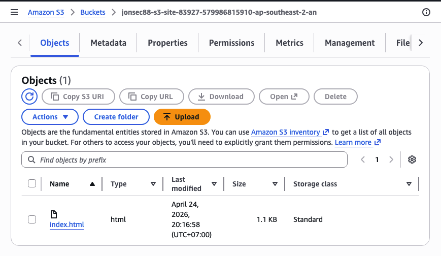
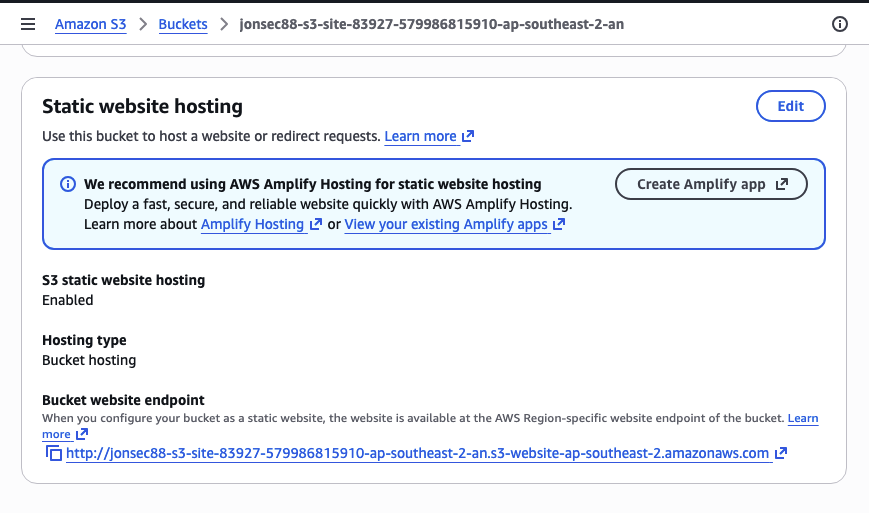
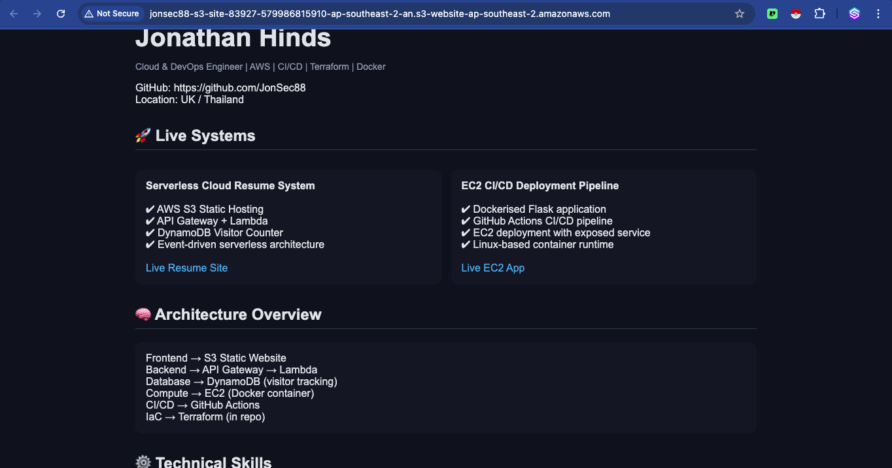
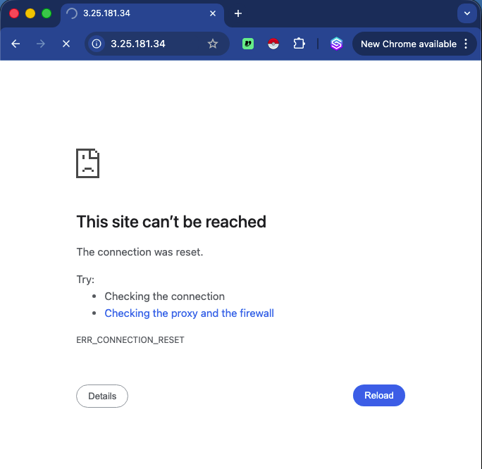
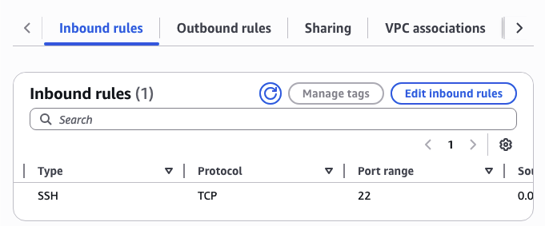
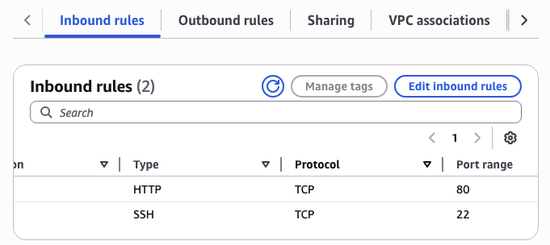

# 🚀 Cloud DevOps Engineer Portfolio (AWS Production Simulation)

## 👤 Jonathan Hinds  
Cloud / DevOps Engineer  
GitHub: https://github.com/JonSec88  

---

## 🧭 System Overview

End-to-end AWS DevOps project demonstrating CI/CD automation, containerised deployment, infrastructure as code, and real cloud debugging.

---

## 🌐 Live Systems

### EC2 Application (Docker + CI/CD)
http://3.25.181.34  

### S3 Static Resume Site
http://jonsec88-s3-site-83927-579986815910-ap-southeast-2-an.s3-website-ap-southeast-2.amazonaws.com/

---

## 🧱 Architecture

docs/architecture.png

---

## 🔧 EC2 Deployment (Docker + CI/CD)

---

## 🚀 CI/CD Pipeline

- GitHub Actions triggered on push  
- SSH deployment to EC2  
- Docker rebuild + restart automation  

---

## ☁️ S3 Static Website

---

## 🌐 Networking & Debugging

Real AWS security group incident resolved.

---

## 🏗️ Infrastructure as Code (Terraform)

AWS infrastructure provisioned using Terraform.

---

## 📁 Repository Structure

.github/ → CI/CD workflows  
app/ → Flask Docker application  
docs/ → Architecture + screenshots  
resume-site/ → Static frontend  
terraform/ → Infrastructure as Code  

---

## 🧰 Tech Stack

AWS • Docker • Terraform • GitHub Actions  
Python • HTML • Bash  
Linux (EC2)

---

## 🧠 Engineering Value

✔ CI/CD automation  
✔ Containerised deployment  
✔ Infrastructure as Code  
✔ Real cloud debugging  
✔ Multi-service AWS architecture  

---

## 🚀 Future Improvements

- Load Balancer (ALB)  
- HTTPS (SSL/TLS)  
- Custom domain  
- Auto scaling
