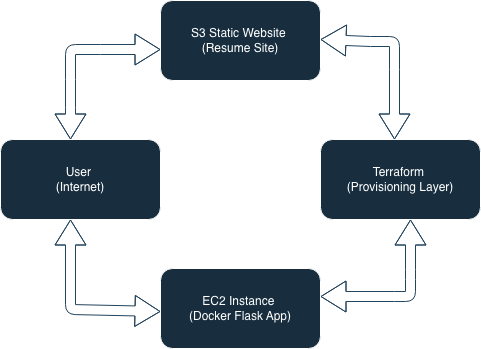

# 🚀 AWS DevOps Portfolio — Production Simulation

## 👤 Jonathan Hinds
DevOps / Cloud Engineer  
GitHub: https://github.com/JonSec88  

---

## 🧱 SYSTEM OVERVIEW

Production-style AWS environment demonstrating:

- Infrastructure as Code (Terraform)
- Dockerised application deployment on EC2
- Static website hosting on S3
- Real-world cloud debugging (break/fix scenario)

---

## 🏗️ ARCHITECTURE

---

## 🌐 LIVE SYSTEMS

### EC2 Application
http://3.25.181.34

### S3 Static Website
http://jonsec88-s3-site-83927-579986815910-ap-southeast-2-an.s3-website-ap-southeast-2.amazonaws.com/

---

## ⚙️ INFRASTRUCTURE

### EC2 + Docker
- Flask app containerised with Docker
- Running on AWS EC2 Linux instance
- HTTP access via security group

Files:
- app/app.py  
- app/Dockerfile  

---

### S3 Static Website
- Resume site hosted on S3
- Public bucket with website hosting enabled

Files:
- resume-site/index.html  

---

### Terraform (IaC)
- EC2 provisioned via Terraform
- Security groups defined in code

Files:
- terraform/main.tf  

---

### Break/Fix Incident

**Problem**
- Site not accessible over HTTP  

**Root Cause**
- Missing port 80 inbound rule  

**Fix**
- Added HTTP rule (0.0.0.0/0)  

**Result**
- Site restored  

Evidence:
- docs-task-2-break-fix/screenshots/

---

## 📁 STRUCTURE

app/  
resume-site/  
terraform/  
docs/  
docs-task-2-break-fix/  

---

## 🧰 TECH STACK

AWS: EC2, S3  
DevOps: Docker, Terraform  
Languages: Python, HTML  
OS: Linux  

---

## 🚀 DEPLOYMENT

### Terraform
terraform init  
terraform apply  

### Docker
docker build -t app .  
docker run -p 80:80 app  

---

## 💰 COST

~$5–15/month (EC2 + S3)

---

## 🔥 OUTCOME

Real-world DevOps project demonstrating:

- Cloud infrastructure deployment  
- Containerisation  
- Infrastructure as Code  
- Incident debugging  
