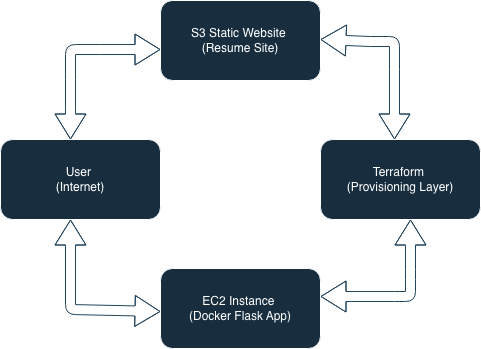

# 🚀 AWS Cloud DevOps Portfolio (Production Architecture)

## 👤 Jonathan Hinds

Cloud / DevOps Engineer

---

# 🧭 Overview

Production-style AWS environment demonstrating full-stack cloud engineering across:

* Static frontend hosting (S3)
* Server-side compute (EC2 + Docker)
* Load balancing (ALB)
* Serverless architecture (API Gateway + Lambda + DynamoDB)
* Infrastructure as Code (Terraform)
* CI/CD automation (GitHub Actions)
* Real-world networking + DNS + certificate debugging

---

# 🌐 Live Production Systems

## 🟢 Primary Portfolio Site (S3)

[https://www.jonsec.cloud/](https://www.jonsec.cloud/)

Static resume website hosted on AWS S3.
Primary entry point for all visitors.

---

## ⚡ Visitor Counter API (Serverless)

[https://api.jonsec.cloud/](https://api.jonsec.cloud/)

Architecture:

```text id="a1"
API Gateway → Lambda → DynamoDB
```

Example response:

```json id="a2"
{"visits": 34}
```

---

## 🖥️ EC2 Application (Docker Hosted)

[http://ec2.jonsec.cloud/](http://ec2.jonsec.cloud/)

* Flask application
* Docker container deployment
* Linux EC2 instance

---

## ⚖️ Application Load Balancer

[http://alb.jonsec.cloud/](http://alb.jonsec.cloud/)

* Routes traffic to EC2 target group
* Health-checked backend system

---

# 🧱 Full Architecture

```text id="a3"
User
 ├── S3 Static Site (www.jonsec.cloud)
 ├── API Gateway → Lambda → DynamoDB (api.jonsec.cloud)
 └── ALB → EC2 Docker App (ec2.jonsec.cloud)
```

---

# 📸 Architecture Diagram



---

# ☁️ S3 Static Hosting (Frontend Layer)

* Static resume website hosted on AWS S3
* Public bucket access configured
* Global entry point for portfolio

### Evidence:

* docs/screenshots/s3/s3-upload.png
* docs/screenshots/s3/s3-hosting-enabled.png
* docs/screenshots/s3/s3-live-site.png
* docs/screenshots/s3/s3-bucket-overview.png

---

# ⚡ Serverless API (Visitor Counter System)

* API Gateway (HTTP API)
* AWS Lambda (Python runtime)
* DynamoDB (persistent counter storage)
* Custom domain + SSL via ACM

### Features:

* Stateless request handling
* Persistent visit tracking
* JSON response API

### Evidence:

* docs/screenshots/api/api-gateway.png
* docs/screenshots/api/lambda.png
* docs/screenshots/api/dynamodb.png

---

# 🖥️ EC2 Deployment (Docker + CI/CD)

* Flask application containerised using Docker
* Hosted on AWS EC2 Linux instance
* Exposed via port 80
* Automated deployment via GitHub Actions

### Evidence:

* docs/screenshots/ec2/ec2-live-app.png
* docs/screenshots/ec2/docker-running.png
* docs/screenshots/ec2/cicd-success.png

---

# ⚖️ Application Load Balancer (ALB)

* Internet-facing AWS ALB
* Routes traffic to EC2 target group
* Health check monitoring enabled

### Evidence:

* docs/screenshots/alb/alb-live.png
* docs/screenshots/alb/target-healthy.png
* docs/screenshots/alb/listener.png

---

# 🌐 Networking & Real Debugging

Real AWS production issues resolved:

* DNS NXDOMAIN resolution
* ACM certificate validation issues
* API Gateway stage deployment issues
* HTTP API routing mismatch
* Custom domain mapping failures
* Security group access fixes

### Evidence:

* docs/screenshots/networking/dns-issue.png
* docs/screenshots/networking/sg-fix.png
* docs/screenshots/networking/alb-fix.png

---

# 🏗️ Infrastructure as Code (Terraform)

* Fully reproducible AWS infrastructure
* Version-controlled cloud provisioning
* Multi-service architecture support

---

# ⚙️ CI/CD Pipeline (GitHub Actions)

* Automated Docker build
* EC2 deployment via SSH
* Push-based continuous deployment
* Zero manual deployment steps

---

# 🧰 Tech Stack

AWS (S3, EC2, ALB, API Gateway, Lambda, DynamoDB, Route53, ACM)
Docker • Terraform • GitHub Actions
Python • Flask • JavaScript • HTML • Bash
Linux (Amazon EC2)

---

# 🧠 Engineering Highlights

✔ Multi-layer AWS architecture (frontend + backend + serverless)
✔ Real production DNS + SSL configuration
✔ Containerised compute environment
✔ Serverless API with persistent storage
✔ Infrastructure as Code (Terraform)
✔ Fully automated CI/CD pipeline
✔ Real-world AWS debugging (networking, DNS, certificates, routing)
✔ Custom domain production deployment

---

# 🚀 Outcome

This project demonstrates real-world cloud engineering capability across:

* Cloud architecture design
* Serverless systems
* Containerised deployments
* Networking and DNS engineering
* Production debugging and recovery
* Automation and CI/CD pipelines

---

# 🚀 Future Improvements

* CloudFront CDN for S3 site
* Auto Scaling Groups for EC2
* WAF security layer
* Observability (CloudWatch dashboards)
* Blue/Green deployment strategy
* Cost optimisation improvements

---

# 🔗 Repository

GitHub: [https://github.com/JonSec88](https://github.com/JonSec88)
